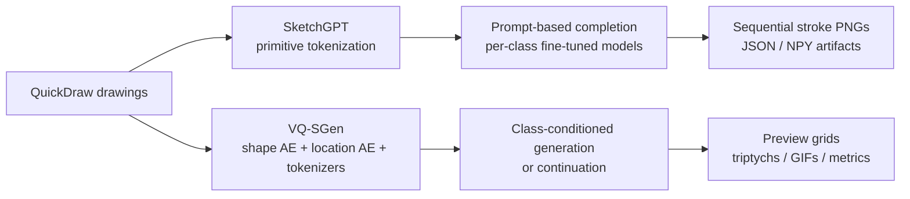

# Doodle to Dream


## Overview

The project contains two separate pipelines built around the same goal:

- **SketchGPT**: a primitive-token autoregressive transformer for **prompt-based sketch completion**.
- **VQ-SGen**: a **shape/location token** pipeline for class-conditioned or prefix-conditioned sketch generation.

Both implementations are organized around QuickDraw data and both emphasize **sequential visualization**, so you can inspect how a drawing emerges stroke by stroke.



## Why this repository exists

This repo is not just about generating a final doodle. It is about modeling the **drawing process**.

That matters in settings such as:

- sketchbook or Pictionary-like games,
- interactive drawing agents,
- early-recognition evaluation,
- sequential generation research,
- comparing tokenization strategies for sketches.

In practice, the repository answers the question:

> **How does the drawing unfold over time, and how different does that process look under SketchGPT vs. VQ-SGen?**

## What is implemented

### 1) SketchGPT pipeline

`SketchGPT/` contains a modular implementation of the generation / completion part of SketchGPT.

From the code, the pipeline is organized as follows:

1. Download QuickDraw simplified `.ndjson` files.
2. Keep **recognized** sketches.
3. Run an **EDA step** to determine sequence-related settings such as primitive count and effective sequence length.
4. Convert strokes into a **primitive-token sequence**.
5. Pre-train a shared transformer on mixed classes.
6. Fine-tune **one model per class**.
7. Provide a prompt prefix from a real sketch.
8. Autoregressively complete the remaining strokes.
9. Save both final and intermediate sequential renderings.

Key implementation details visible in the code:

- configurable EDA / pretrain / finetune skipping via CLI,
- per-class checkpoints,
- raw-vs-generated visualization,
- sequential export as **PNG**, **JSON**, and **NPY**,
- output folders timestamped under `SketchGPT/outputs/`.

### 2) VQ-SGen pipeline

`VQ-SGen/` contains a QuickDraw-focused VQ-SGen-style generation pipeline.

From the code, this implementation includes:

1. QuickDraw-only data preparation.
2. Optional canonical stroke reordering.
3. A **shape autoencoder** and **location autoencoder**.
4. Separate **shape** and **location** tokenizers / codebooks.
5. A class-conditioned transformer generator over token sequences.
6. Teacher-forced evaluation.
7. Class-conditioned sampling and continuation evaluation.
8. Saved preview artifacts such as **grids**, **triptychs**, and **GIFs**.

Key implementation details visible in the code:

- separate shape/location token streams,
- configurable pretrained-vs-finetune stage control,
- QuickDraw `recognized=True` filtering,
- continuation evaluation with prefix / prediction / ground-truth comparison,
- artifact saving under workspace-specific `artifacts/`, `tokens/`, `embeddings/`, and `checkpoints/` directories.

## SketchGPT vs. VQ-SGen at a glance

| Aspect | SketchGPT | VQ-SGen |
|---|---|---|
| Main idea | Primitive-token autoregressive completion | Discrete shape/location token generation |
| Conditioning | Prompt prefix from an existing sketch | Class-conditioned generation, plus continuation evaluation |
| Model granularity | Per-class fine-tuned models | Shared multi-stage pipeline with tokenizers and generator |
| Sequential outputs | Strongly emphasized; per-sample stroke buildup exported | Preview grids, continuation triptychs, GIFs, decoded canvases |
| Best suited for | Completion-style drawing process analysis | Representation-heavy generation and token-level analysis |

## Repository layout

```text
DoodleToDream-main/
├── README.md
├── pyproject.toml
├── requirements.txt
├── scripts/
│   ├── check_sketchgpt.py
│   ├── check_vq_sgen.py
│   ├── run_sketchgpt.py
│   └── run_vq_sgen.py
├── SketchGPT/
│   ├── configs/
│   └── src/sketchgpt/
├── VQ-SGen/
│   ├── configs/
│   └── src/vq_sgen/
├── evaluation_metrics/
│   ├── classification_metrics.py
│   ├── evaluation_KID.py
│   └── KID/
└── sketchGPT.py
```

### Main directories

- `SketchGPT/` — modular SketchGPT implementation.
- `VQ-SGen/` — modular VQ-SGen implementation.
- `scripts/` — entry points and syntax checks.
- `evaluation_metrics/` — KID and classification-style evaluation utilities.
- `sketchGPT.py` — legacy monolithic script version of the SketchGPT pipeline.

## Installation

Tested as a standard Python project with Python **3.9+**.

```bash
python3 -m venv .venv
source .venv/bin/activate
python3 -m pip install --upgrade pip
python3 -m pip install -r requirements.txt
```

## Sanity checks

The repository includes lightweight syntax-check scripts:

```bash
python3 scripts/check_sketchgpt.py
python3 scripts/check_vq_sgen.py
```

## Quick start

### Run SketchGPT

```bash
python3 scripts/run_sketchgpt.py
```

To use the smaller smoke-test config:

```bash
python3 scripts/run_sketchgpt.py --config configs/smoke_test.json
```

### Run VQ-SGen

```bash
python3 scripts/run_vq_sgen.py
```

To use the smaller smoke-test config:

```bash
python3 scripts/run_vq_sgen.py --config configs/smoke_test.json
```

## Configuration

### SketchGPT config

SketchGPT reads JSON configs from:

- `SketchGPT/configs/config.json`
- `SketchGPT/configs/smoke_test.json`

Useful skip flags are also exposed at the CLI level:

```bash
python3 scripts/run_sketchgpt.py --skip-eda --skip-pretrain --skip-finetune
```

### VQ-SGen config

VQ-SGen reads JSON configs from:

- `VQ-SGen/configs/config.json`
- `VQ-SGen/configs/smoke_test.json`

The default full config is clearly oriented toward a Colab / Google Drive style environment, so for local execution you will usually want to edit paths such as:

- `DRIVE_PROJECT_ROOT`
- `WORKSPACE_ROOT`
- run mode and dataset scale settings

The smoke-test config is the better starting point for a local first run.

## Outputs and artifacts

### SketchGPT outputs

SketchGPT saves outputs under a timestamped folder:

```text
SketchGPT/outputs/<timestamp>/
```

Important artifacts produced by the code include:

- `generated_sketches.png` — original vs. generated comparison,
- `sequential/overview.png` — multi-sample overview,
- `sequential/<class>/preview.png` — class-level preview,
- `sequential/<class>/sample_XX/stroke_001.png ... stroke_N.png` — stepwise drawing buildup,
- `sequential/<class>/sample_XX/stroke_all.png` — final sketch,
- `sequential/<class>/sample_XX/strokes.json` — structured stroke export,
- `sequential/<class>/sample_XX/strokes.npy` — numeric stroke export.

### VQ-SGen outputs

VQ-SGen writes to workspace-specific folders determined by the config. The code saves artifacts such as:

- class-conditioned sample grids,
- continuation preview triptychs,
- predicted GIFs,
- config snapshots,
- token / embedding `.npz` files,
- generator result JSON summaries,
- checkpoints for the individual stages.

Because VQ-SGen is highly config-driven, output locations depend on `WORKSPACE_ROOT` and the derived stage directories.

## Evaluation

The repository includes two evaluation utilities under `evaluation_metrics/`:

### 1) KID evaluation

- `evaluation_metrics/evaluation_KID.py`
- compares generated final sketches against stored reference images,
- supports both global and class-wise KID computation.

### 2) Classification-style evaluation

- `evaluation_metrics/classification_metrics.py`
- evaluates final-image classification quality,
- includes an **early recognition score** for sequential stroke images.

This is especially relevant for sketchbook-game scenarios, because a good sketch is not only recognizable at the end — it should become recognizable **early enough during the drawing process**.

> Note: the evaluation scripts currently contain environment-specific absolute paths and are intended to be adapted before running.

## Recommended figures for the README

This repository is highly visual, so the README works best when you place generated figures near the top. A good presentation order is:

1. **QuickDraw class gallery** — already included in `docs/images/quickdraw_gallery.png`
2. **SketchGPT original vs. generated comparison**
3. **SketchGPT sequential overview**
4. **VQ-SGen class-conditioned generation grid**
5. **VQ-SGen continuation triptych or GIF**

Suggested file names if you want to enrich the README later:

```text
docs/images/sketchgpt_generated_sketches.png
docs/images/sketchgpt_sequential_overview.png
docs/images/vq_sgen_class_conditioned_grid.png
docs/images/vq_sgen_continuation_preview.png
docs/images/vq_sgen_continuation.gif
```

## Use cases

This repository is useful if you are interested in:

- sketch generation research,
- sequential drawing analysis,
- prompt-based sketch completion,
- tokenization strategies for vector sketches,
- interactive drawing systems,
- sketchbook / Pictionary-like game agents.

## Notes

- Both pipelines are centered on **QuickDraw-style stroke data**.
- The implementations are organized for experimentation and visualization, not only for final benchmark numbers.
- The repo combines a relatively straightforward completion pipeline (SketchGPT) with a more structured representation-learning pipeline (VQ-SGen), making it useful for **qualitative comparison** as well as model prototyping.

## Acknowledgment

This repository builds on the ideas behind **SketchGPT** and **VQ-SGen-style** sketch generation, and adapts them into a practical workspace focused on **stroke-wise generation, visualization, and comparison**.
